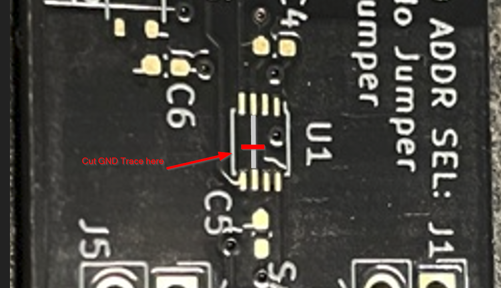
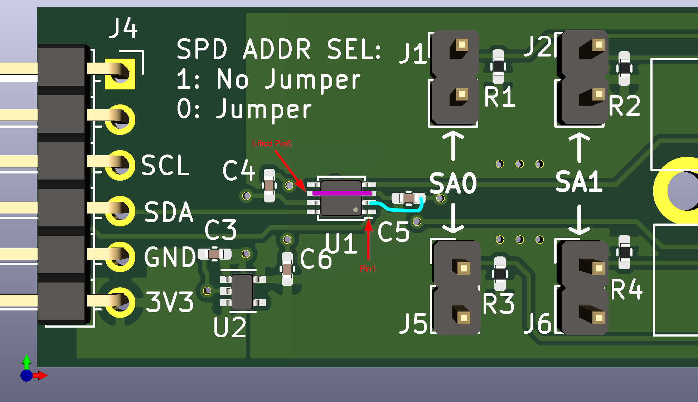

= Dimmlet MCN rev1-E1

== Rationale

Upon bringing up the rev1 dimmlet board, it was discovered that U1, the TXS0102 part was designed in backwards, and there's a constraint that Vccb >= Vcca whereas the design had Vcca > Vccb. It was confirmed that this does not work.

In order to salvage the boards, the following rework was identified in order to correct this issue.

Since these were hand-assembled, this issue was identified and corrected on the first unit and the rework was applied to each subsequent board that was built.

== Material/Tools

Nothing special except some 30ga wire, optical magnification, and tweezers.

== Physical Rework steps

The overview of the rework is that we're going to cut a trace (GND pin) under U1, lift the OE pin so we can tack it to enabled, install the U1 rotated 180 degrees

These steps assume an un-populated U1 location.

. Lift OE pin. Bend pin6 up so that it won't be soldered to the board when the chip is installed.
. Cut GND trace as shown below.

. Install the chip with pin1 near C5.

. Add a jumper wire from U1 pin3 (Vcca) to flown/lifted U1 pin6 (OE) Magenta line in image below.

. Add a jumper wire from C5's ground pin to U1 pin2 (Gnd) Cyan line in image below.

. Optional: After testing to confirm functionality, it may be desireable to put superglue or epoxy on this rework to increase it's strength.

. Re-label board as rev1-E1

== Determinations

PCB CAD and schematic were both updated to allow a rev2 spin of this board without rework even though no rev2 spin is planned.
