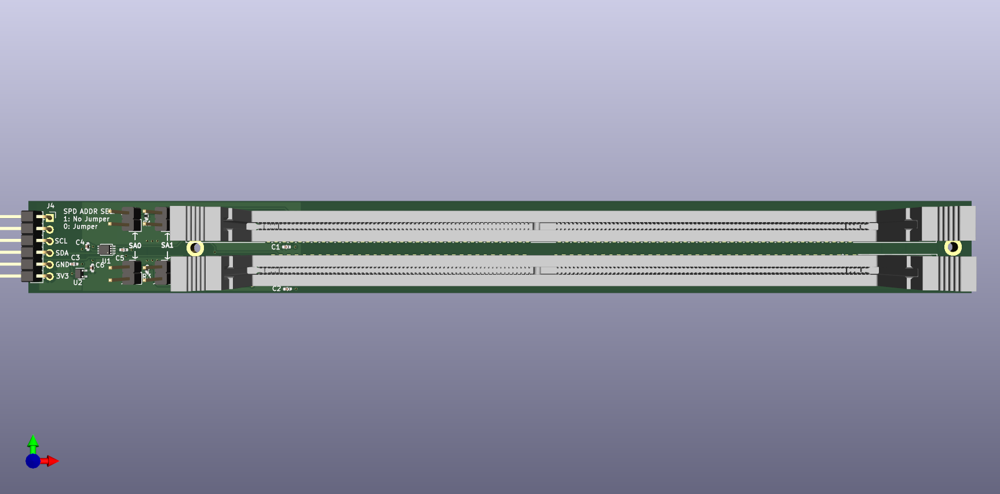

# hw-dimmlet

Breaks out I2C connections to 2x DIMM sockets to a PMOD i2c interface for SPD work.
Works well with gimletlet

# Status
Rev1 required MCNs as documented. CAD was updated to resolve these
issues but new CAD was not actually built since the reworked rev1s
served their purpose
